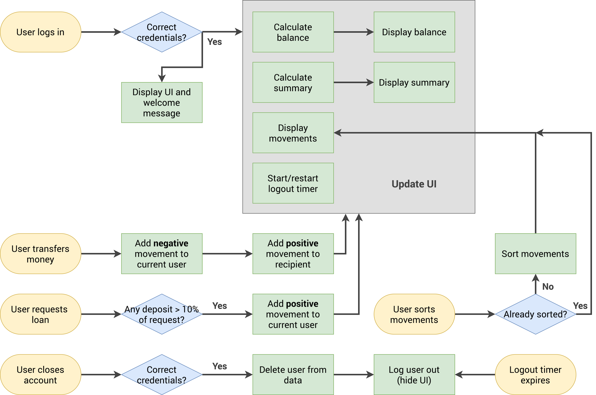

# Bankist App

Bankist is a single-page banking dashboard that simulates a real-world online banking web application. It handles dynamic data computations, securely tracks multiple user accounts, and offers interactive transaction operations like transfers, loan requests, and real-time ledger sorting.

---

## 🗺️ Application Workflow Diagram

The complete functional architecture, state update triggers, operational conditions, and UI cycles are mapped out in the flowchart below:



---

## 🛠️ Tech Stack

*   **Structure:** HTML5 (semantic dashboard wireframes)
*   **Styling:** CSS3 (Featuring custom multi-gradient indicators, smooth application transitions, and scrollable data containers)
*   **Typography:** Poppins (Google Fonts)
*   **Logic Engine:** Vanilla JavaScript (ES6+ array mapping/reducing pipelines, Internationalization APIs, and state handling)

---

## ✨ Key Features

*   **Secure User Login:** Authenticates simulated accounts using computed initials as usernames and a matching 4-digit PIN.
*   **Live Ledger Rendering:** Automatically processes deposit and withdrawal histories with dynamic relative day tags (e.g., "Today", "Yesterday", "3 days ago").
*   **Internationalization (Intl API):** Formats currency indicators and localized timestamps fluidly depending on the logged-in user's profile settings (e.g., EUR vs USD).
*   **Peer-to-Peer Transfers:** Instantly checks balances and shifts funds securely from the active user's wallet to another account profile.
*   **Conditional Loan Requests:** Grants approved loans instantly after validating that the user has at least one previous deposit greater than 10% of the requested amount.
*   **Transaction Record Sorting:** Toggles your financial dashboard back and forth between chronological ledger order and value-sorted view lines.
*   **Account Termination Option:** Offers account deletion capabilities by purging the user array upon inputting matching confirmation credentials.
*   **Automatic Security Logout Timer:** Implements a strict countdown clock that completely locks down and hides the banking panel when the user remains idle for too long.

---

## 📂 File Structure

```text
├── index.html            # Main HTML banking application framework
├── style.css             # Visual panel grid alignments and gradient stylings
├── script.js             # Simulation arrays, formatting functions, and transactional engines
└── Bankist-flowchart.png # Technical user-journey blueprint architecture image
